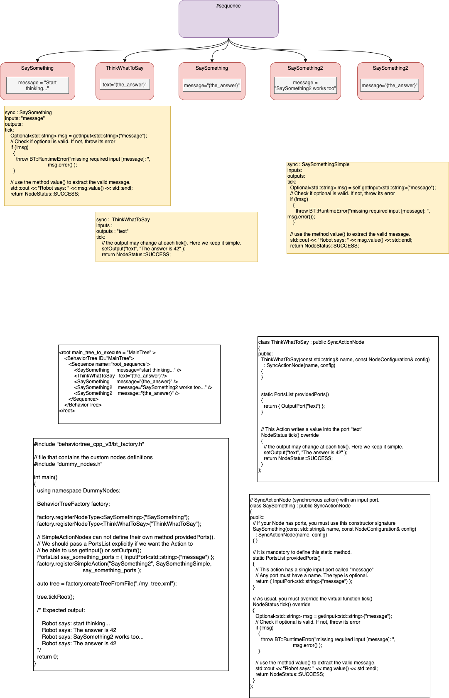

# Overview
- experiment for converting diagram->JSON->C++
- using https://www.behaviortree.dev/tutorial_02_basic_ports/ as the target

## Diagram
- Sequence node is purple
- Sync Actions nodes are red
- C++ templates are yellow
- code snippets are gray
- comments are white

![[tree.png]]

- sequence nodes must contain "#sequence" as the text
- Sync Action nodes must contain a valid C++ identifier as the name
- arrows join #sequence node to its children
- children are executed from left to right using BT semantics

## Makefile
- transpiles tree.drawio -> component.json
- file "fb.pl" is used as the factbase
- ./extend appends new facts to fb.pl

## Diagram Transpiler
- diagram converted to raw factbase using d2f
- 6 queries on raw factbase -> parse out semantics of diagram to factbase
- emitter.pl converts factbase into JSON
- creates out.xml from JSON
- creates tokens from JSON -> creates component JSON file

## PREP Tool
- uses Ohm-JS to pattern-match tokens.json
- uses Glue to reformat pattern captures -> component.json
- prep is used in parsecomponent.bash and in tokenize.bash

[PREP github](https://github.com/guitarvydas/prep)

## XML

- out.xml
- defines Behavior Tree
- targeted as input to Behavior Tree code

## Emitcpp.drawio

- diagram of code to glue together code snippets into final C++ program
- defines internals of emitcpp.js
- hand-compiled for this POC (future: use d2f, d2py, etc. to compile diagram)

### Top

![[emitcpp-top.png]]

### Main

![[emitcpp-main.png]]

### Per Component

![[emitcpp-per component.png]]

### Class

![[emitcpp-class.png]]

### Ports

![[emitcpp-ports.png]]

### Tick

![[emitcpp-tick.png]]

## treefact(...) vs. diagram_fact(...)
- diagram_fact facts are generated by d2f
- treefact facts are generated by this Makefile
## .comp files
- .bash scripts
- all args via pipe (mkfifo)
- no command-line arg
- all sub-scripts relative to $root
- all outputs to pipe
- /dev/fd/3,4,5, ... 
	- avoid 0, 1, 2 (stdin, stdout, stderr)
- future: use sockets instead of pipes
## Basic Operations

- join
- call
- xcall
- constant
- edit
	- edit		/@/g
	- edit1		/@1/g
	- edit2		/@2/g
	- edit3		/@3/g
- select
- *composition*

## Encoded Code Snippets

- Lines of code are stored in encodeURIComponent form.
- decodeURIComponent called as last step during emitting

